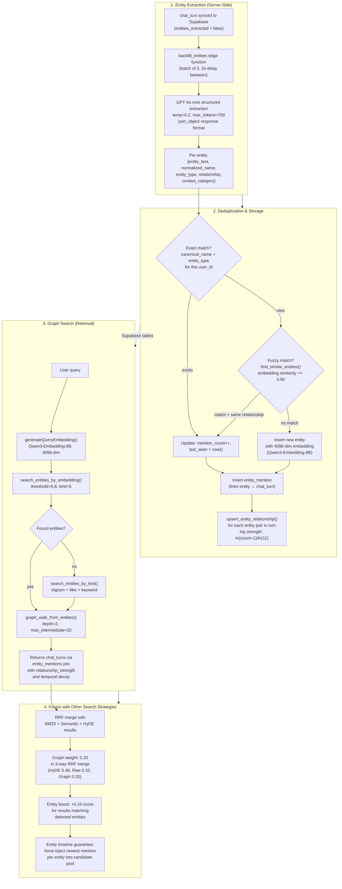
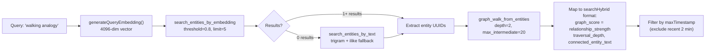
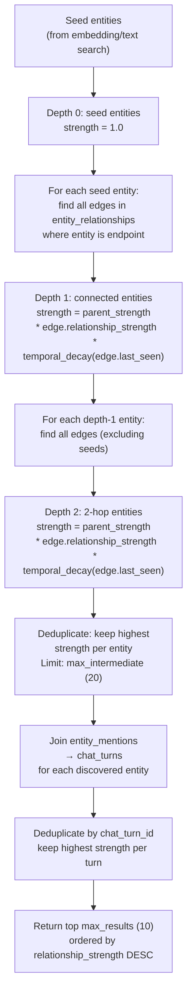

# KYT GraphRAG — Architecture & Data Flow

> How entities are extracted, stored as a knowledge graph, and traversed at retrieval time
> to surface conceptually related memories that vector similarity alone would miss.
> All references accurate against the codebase as of 2026-02-17.

---

## What GraphRAG Adds to the Pipeline

Standard RAG retrieves documents by embedding similarity to the query. This fails when:
- The user asks about "Jennifer" but the most relevant memory is about "Jenn" (alias)
- Two people share the same name but have different relationships (Jennifer the trainer vs Jennifer the sister)
- The connection is conceptual, not textual ("walking analogy" → a chat_turn about learning through failure)
- The newest factual statement about an entity is short (5 words) and gets buried by a long, semantically rich older conversation

GraphRAG solves these by maintaining a **typed entity graph** alongside the vector index. Entities are extracted from conversation turns via GPT-4o-mini, linked to their source `chat_turns` via `entity_mentions`, and connected to each other via `entity_relationships` with co-occurrence strength and temporal decay. At retrieval time, the system finds relevant entities, walks the graph to discover related entities, and pulls the `chat_turns` those related entities appear in — results that pure vector search would never surface.

---

## End-to-End Flow



---

## Database Schema

Three tables form the graph. RLS on all three ensures users only see their own data.

### `entities` — Canonical Nodes

Each unique entity (person, concept, project, etc.) gets one row per user. The canonical name includes the relationship to disambiguate (e.g., `jennifer_trainer` vs `jennifer_sister`).

```sql
CREATE TABLE entities (
    id UUID PRIMARY KEY DEFAULT gen_random_uuid(),
    user_id UUID NOT NULL REFERENCES auth.users(id) ON DELETE CASCADE,

    -- Identity
    entity_text TEXT NOT NULL,          -- Original surface form: "Jennifer"
    normalized_name TEXT,               -- Lowercase: "jennifer"
    canonical_name TEXT NOT NULL,       -- Disambiguated: "jennifer_trainer"
    display_name TEXT,                  -- User-facing: "Jennifer"

    -- Classification
    entity_type TEXT NOT NULL,          -- PERSON|ORG|LOCATION|PROJECT|TECH|MISC|CONCEPT|ANALOGY|THEME
    relationship TEXT DEFAULT 'unknown', -- "trainer"|"sister"|"colleague"|etc.
    context_category TEXT DEFAULT 'general', -- "fitness"|"family"|"work"|etc.

    -- Embedding (Qwen3-Embedding-8B)
    embedding VECTOR(4096),

    -- Usage tracking
    mention_count INT DEFAULT 1,
    first_seen TIMESTAMPTZ DEFAULT NOW(),
    last_seen TIMESTAMPTZ DEFAULT NOW(),
    metadata JSONB DEFAULT '{}'::jsonb,

    CONSTRAINT unique_user_entity UNIQUE(user_id, canonical_name, entity_type)
);
```

**Entity types:**

| Type | Examples | Added |
|------|----------|-------|
| `PERSON` | Jerry, Jennifer, Dr. Smith | Original |
| `ORG` | Google, YC Combinator | Original |
| `LOCATION` | Boston, the gym | Original |
| `PROJECT` | K.Y.T., my startup | Original |
| `TECH` | PostgreSQL, React | Original |
| `MISC` | "shrimp preference" | Original |
| `CONCEPT` | Imposter syndrome, flow state | 2026-02-15 |
| `ANALOGY` | Walking analogy for learning | 2026-02-15 |
| `THEME` | Personal growth, career change | 2026-02-15 |

**Key indexes:**
- `ivfflat(embedding vector_cosine_ops)` — vector similarity search
- `GIN(canonical_name gin_trgm_ops)` — trigram fuzzy text search
- `(user_id, canonical_name)` — exact lookup
- `(user_id, last_seen DESC)` — recency ordering
- `(user_id, normalized_name, entity_type)` — dedup lookup

### `entity_mentions` — Links Entities to Conversation Turns

Every time an entity appears in a `chat_turn`, a mention row is created. This is the bridge between the graph and the conversation content.

```sql
CREATE TABLE entity_mentions (
    id UUID PRIMARY KEY DEFAULT gen_random_uuid(),
    entity_id UUID NOT NULL REFERENCES entities(id) ON DELETE CASCADE,
    chat_turn_id UUID NOT NULL REFERENCES chat_turns(id) ON DELETE CASCADE,
    conversation_id TEXT,
    mention_text TEXT NOT NULL,       -- Surface form in this occurrence: "Jenn"
    context_before TEXT,              -- ~100 chars before mention
    context_after TEXT,               -- ~100 chars after mention
    confidence FLOAT DEFAULT 0.0,    -- NER confidence (0-1)
    timestamp TIMESTAMPTZ DEFAULT NOW()
);
```

This table answers two critical questions:
- **Given an entity, which chat_turns mention it?** (graph walk → content retrieval)
- **Given a chat_turn, which entities appear in it?** (entity enrichment on search results)

### `entity_relationships` — Graph Edges

Tracks co-occurrence between entity pairs within the same conversation turn. Edge weight grows logarithmically with mention count and decays over time.

```sql
CREATE TABLE entity_relationships (
    id UUID PRIMARY KEY DEFAULT gen_random_uuid(),
    user_id UUID NOT NULL REFERENCES auth.users(id) ON DELETE CASCADE,
    entity_a_id UUID NOT NULL REFERENCES entities(id) ON DELETE CASCADE,
    entity_b_id UUID NOT NULL REFERENCES entities(id) ON DELETE CASCADE,
    co_occurrence_count INT DEFAULT 1,
    relationship_strength FLOAT DEFAULT 0.1,   -- 0-1, logarithmic scale
    relationship_type TEXT DEFAULT 'co_occurrence',
    first_seen TIMESTAMPTZ DEFAULT NOW(),
    last_seen TIMESTAMPTZ DEFAULT NOW(),

    CONSTRAINT unique_entity_pair UNIQUE(user_id, entity_a_id, entity_b_id),
    CONSTRAINT entity_order CHECK (entity_a_id < entity_b_id)
);
```

**Relationship types:**

| Type | When assigned | Example |
|------|--------------|---------|
| `family_of` | PERSON + family relationship | Jerry — wife |
| `works_with` | PERSON + work/service relationship | Jennifer — gym client |
| `illustrates` | ANALOGY + CONCEPT/THEME | Walking analogy — learning process |
| `discussed_together` | CONCEPT/THEME co-occurrence | Imposter syndrome — career change |
| `co_occurrence` | Default fallback | Any two entities in same turn |

**Strength formula (logarithmic):**
```
relationship_strength = min(1.0, ln(co_occurrence_count + 1) / ln(11))
```

| Co-occurrences | Strength |
|----------------|----------|
| 1 | 0.29 |
| 3 | 0.58 |
| 5 | 0.75 |
| 10 | 1.00 |

---

## Entity Extraction Pipeline

### Trigger

`backfill_entities` edge function, triggered by:
1. `triggerEntityBackfill()` in `browser-sync.js` — fire-and-forget after each sync
2. `KYT_DEBUG.backfillEntities()` — manual debug trigger
3. Extension update handler — clears and re-triggers backfill

### Extraction (GPT-4o-mini)

**File:** `supabase/functions/_shared/entity-extractor.ts`

For each `chat_turn` where `entities_extracted = false`:

1. Send content + speakers to GPT-4o-mini with a structured extraction prompt.
2. Model returns JSON array of entities with:
   - `entity_text` — surface form ("Jennifer")
   - `normalized_name` — lowercase key ("jennifer")
   - `entity_type` — one of 9 types
   - `relationship` — how the entity relates to the user ("trainer", "sister", "friend")
   - `context_category` — topical bucket ("fitness", "family", "work")

**Batch constants:** 5 turns per batch, 2s delay between batches, max 100 turns per invocation.

### Deduplication

Canonical name = `normalized_name` + `_` + `relationship`. This is the key insight for disambiguation:

```
"Jennifer" (trainer context) → canonical: "jennifer_trainer"
"Jenn" (trainer context)     → canonical: "jenn_trainer"
"Jennifer" (sister context)  → canonical: "jennifer_sister"
```

**Three-phase dedup:**

1. **Exact match** — Look up `canonical_name` + `entity_type` for this `user_id`. If found, increment `mention_count` and update `last_seen`.

2. **Fuzzy match** — If no exact match, call `find_similar_entities()` RPC with embedding similarity threshold of 0.90. This catches "Jenn" → "Jennifer" when they share the same relationship suffix.

3. **Relationship guard** — Fuzzy matches only merge if the relationship suffix matches. `jenn_trainer` merges into `jennifer_trainer`, but `jennifer_trainer` and `jennifer_sister` stay distinct even if their embeddings are similar.

### Embedding Generation

Each entity gets a 4096-dim embedding from Qwen3-Embedding-8B. The input is formatted as:
```
"{entity_text} ({entity_type}, {relationship})"
→ "Jennifer (PERSON, trainer)"
```

This embeds the disambiguation context into the vector, so `jennifer_trainer` and `jennifer_sister` have meaningfully different embeddings.

### Relationship Tracking

For every pair of entities extracted from the same `chat_turn`, `upsert_entity_relationship()` is called:
- Creates edge if new (with UUID ordering constraint: `entity_a_id < entity_b_id`)
- Increments `co_occurrence_count` if exists
- Recalculates logarithmic `relationship_strength`
- Updates `last_seen` timestamp
- Classifies `relationship_type` based on entity types and relationships

---

## Graph Search at Retrieval Time

### Client-Side Path (`searchGraphWalk`)

**File:** `src/browser-search.js:searchGraphWalk()`

Called as one of 5 parallel strategies inside `searchHybrid()`:



### Server-Side Path (`get_relevant_memories.ts`)

In edge mode, the graph walk runs server-side within the `search_memories` edge function. The flow is the same but:
- Entity search, HyDE generation, and concept detection run in **parallel**
- If a high-confidence entity match (similarity >= 0.85) is found, HyDE is **skipped** (adaptive short-circuit)
- Graph results merge into a **3-way RRF** with HyDE and raw vector results
- Entity timeline guarantee ensures the newest mention per entity is in the pool

### Graph Walk Algorithm (SQL)

**RPC:** `graph_walk_from_entities(p_entity_ids, p_user_id, p_max_results, p_max_depth, p_max_intermediate)`



**Temporal decay function:**
```
decay = 0.5^(age_seconds / (half_life_days * 86400))
```
- Half-life: 180 days (updated from 90)
- 90 days old → 0.71 weight retained
- 180 days old → 0.50
- 360 days old → 0.25

**Cumulative strength** at depth N:
```
strength_N = strength_(N-1) * edge_strength * temporal_decay(edge.last_seen)
```

This means a 2-hop traversal through two strong (0.75), recent edges yields:
```
1.0 * 0.75 * ~1.0 * 0.75 * ~1.0 = 0.5625
```
While a 2-hop through one weak (0.29), stale (180-day) edge yields:
```
1.0 * 0.29 * 0.50 * ... = 0.145 (and decaying further)
```

The fan-out cap (`max_intermediate=20`) prevents explosion in densely connected graphs.

---

## How Graph Results Merge with Other Strategies

Inside `searchHybrid()` (client-side) or `get_relevant_memories.ts` (server-side), graph walk results are merged with BM25, semantic vector, Supabase text, and HyDE results via RRF.

### RRF Weight Allocation

**Client-side (2-way, no graph weight specified separately):**
```
RRF score per item = Σ 1/(60 + rank_in_list)
```
Graph results enter as one of the ranked lists. Adaptive weights (BM25 vs semantic) apply to non-graph lists.

**Server-side (3-way with explicit graph weight):**
```
HyDE weight:  0.48
Raw weight:   0.32
Graph weight: 0.20
```

### Entity Boost

Results from vector search that happen to mention entities detected in the query get a +0.10 score bonus during reranking. This is separate from graph walk results — it rewards vector search results that are entity-relevant.

### Entity Timeline Guarantee

**RPC:** `get_newest_turns_for_entities(p_entity_ids, p_user_id, p_exclude_turn_ids, p_max_per_entity)`

After RRF merge, for each entity detected in the query:
1. Query `entity_mentions` for the most recent `chat_turn` mentioning that entity.
2. If that turn is NOT already in the candidate pool, inject it with an `entity_timeline` tag.
3. This prevents the "Jerry problem" — where a short, recent factual correction ("Jerry is now real") gets buried by a long, semantically rich older conversation about Jerry.

---

## Concrete Example: "Walking Analogy"

The user once had a conversation where the assistant used a walking/toddler analogy to explain learning through failure. Months later, they search "walking analogy."

**Without GraphRAG:**
- Vector search for "walking analogy" returns conversations about actual walking, exercise, or unrelated analogies.
- The original conversation didn't use the exact phrase "walking analogy" — it said "like a child learning to walk."
- BM25 misses because the keywords don't match.
- Result: 0 relevant items.

**With GraphRAG:**

1. **Entity extraction** (at sync time) tagged the original conversation with entity `walking_analogy_for_learning` (type: `ANALOGY`), linked to entity `learning_through_failure` (type: `CONCEPT`) via `illustrates` relationship.

2. **At search time:**
   - `search_entities_by_embedding("walking analogy")` → no match (threshold 0.8 is strict).
   - Fallback: `search_entities_by_text("walking analogy")` → trigram match on `walking_analogy_for_learning` (similarity ~0.6).
   - `graph_walk_from_entities([walking_analogy_for_learning_id])`:
     - Depth 0: `walking_analogy_for_learning` (strength 1.0)
     - Depth 1: `learning_through_failure` via `illustrates` edge (strength ~0.58)
   - Both entities' `entity_mentions` link to the original `chat_turn`.
   - Result: The original conversation surfaces with `graph_score: 0.58`.

3. **RRF merge** combines this with any vector/BM25 hits. Even if vector search returned nothing, the graph result alone surfaces the memory.

---

## Concrete Example: "Jennifer" Disambiguation

The user has two Jennifers: a personal trainer and a sister.

**Entity graph:**
```
jennifer_trainer (PERSON)  ──── works_with ────  user
       │
       │ co_occurrence (strength: 0.75)
       │
   gym (LOCATION)
   fitness_goals (CONCEPT)

jennifer_sister (PERSON)   ──── family_of  ────  user
       │
       │ co_occurrence (strength: 0.58)
       │
   thanksgiving_dinner (MISC)
   mom (PERSON)
```

**Query: "What did Jennifer say about my progress?"**

1. `search_entities_by_embedding` finds both `jennifer_trainer` (similarity 0.83) and `jennifer_sister` (similarity 0.81).
2. "Progress" keyword disambiguates via graph walk:
   - `jennifer_trainer` → `fitness_goals` (strength 0.75) → chat_turns about workout progress.
   - `jennifer_sister` → `thanksgiving_dinner` (strength 0.58) → unrelated chat_turns.
3. Trainer-linked results have higher cumulative graph score.
4. MMR entity dedup (using canonical names) keeps one result per Jennifer, preferring the higher-scored trainer result.

---

## Constants Reference

| Constant | Value | Location |
|----------|-------|----------|
| **Extraction model** | GPT-4o-mini | `entity-extractor.ts` |
| **Extraction temperature** | 0.2 | `entity-extractor.ts` |
| **Extraction max_tokens** | 700 | `entity-extractor.ts` |
| **Backfill batch size** | 5 turns | `backfill_entities/index.ts` |
| **Backfill batch delay** | 2000ms | `backfill_entities/index.ts` |
| **Backfill max rows** | 100 per invocation | `backfill_entities/index.ts` |
| **Entity embedding model** | Qwen3-Embedding-8B | `entity-extractor.ts` |
| **Entity embedding dims** | 4096 | Migration `20260211000000` |
| **Fuzzy dedup threshold** | 0.90 | `entity-extractor.ts` |
| **Entity search threshold** | 0.80 | `browser-search.js:560` |
| **Entity search limit** | 5 | `browser-search.js:561` |
| **Graph max depth** | 2 hops | `browser-search.js:629` |
| **Graph max intermediate** | 20 entities | `browser-search.js:630` |
| **Graph max results** | 10 | `browser-search.js:628` |
| **Temporal decay half-life** | 180 days | `temporal_decay_factor()` |
| **Strength formula** | `ln(count+1)/ln(11)` | `upsert_entity_relationship()` |
| **Adaptive short-circuit** | entity similarity >= 0.85 | `get_relevant_memories.ts` |
| **Graph RRF weight (server)** | 0.20 | `get_relevant_memories.ts` |
| **Entity boost score** | +0.10 | `get_relevant_memories.ts` |
| **Text search trigram threshold** | 0.15 | `search_entities_by_text()` |
| **Timeline max per entity** | 1 turn | `get_newest_turns_for_entities()` |

---

## File Index

| File | Role |
|------|------|
| `supabase/functions/_shared/entity-extractor.ts` | GPT-4o-mini extraction + dedup + embedding + storage |
| `supabase/functions/backfill_entities/index.ts` | Batch trigger for unprocessed chat_turns |
| `supabase/functions/_shared/get_relevant_memories.ts` | Server-side search pipeline (entity search + graph walk + RRF + timeline guarantee) |
| `src/browser-search.js:searchGraphWalk()` | Client-side graph search (embedding → entities → graph walk → chat_turns) |
| `src/browser-search.js:searchHybrid()` | Orchestrates all 5 parallel search strategies including graph |
| `src/edge-search.js:searchViaEdgeFunction()` | Proxies to server-side pipeline, maps entity fields |
| `background.js:getContextForInjection()` | Enables graph search (`enableGraph: true`), post-processing |
| `background.js:applyRecencyResolution()` | Entity-aware recency resolution (client-side) |
| `src/mmr.js:applyMMR()` | Entity deduplication during diversity reranking |
| `src/browser-sync.js:triggerEntityBackfill()` | Fire-and-forget trigger after sync |
| `migrations/entity_memory.sql` | Core schema (entities, entity_mentions, entity_relationships) |
| `supabase/migrations/20260215*` | CONCEPT/ANALOGY/THEME types, graph_walk_from_entities RPC |
| `supabase/migrations/20260216*` | Text entity search, multi-hop graph walk, relationship classification |
| `supabase/migrations/20260217*` | Temporal decay tuning, logarithmic strength, entity timeline guarantee |
