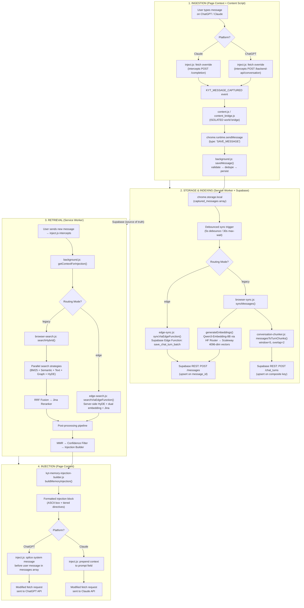
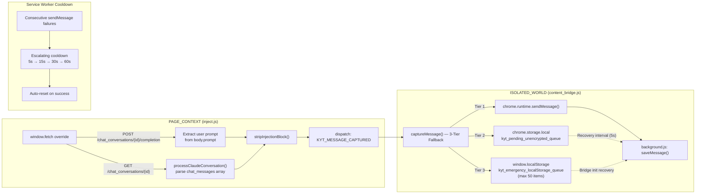
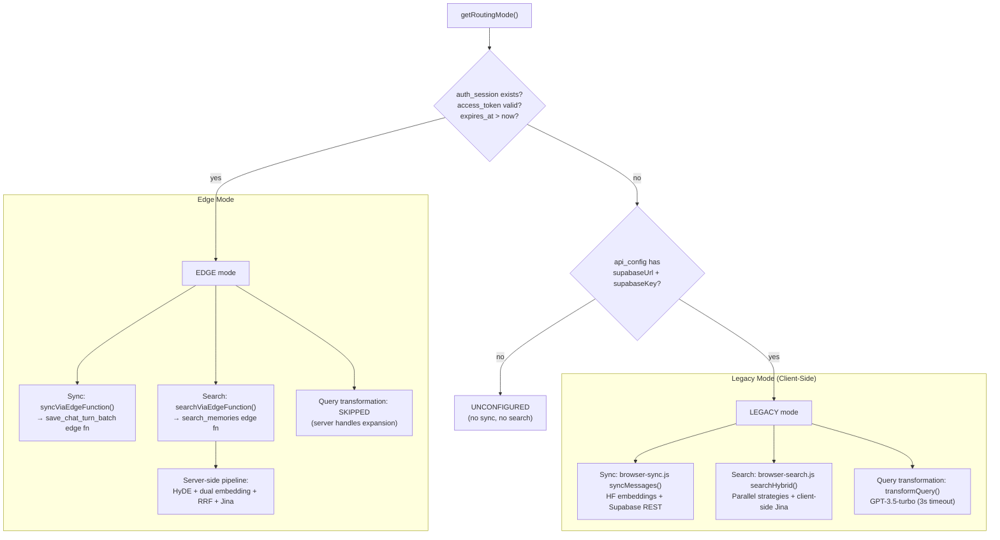
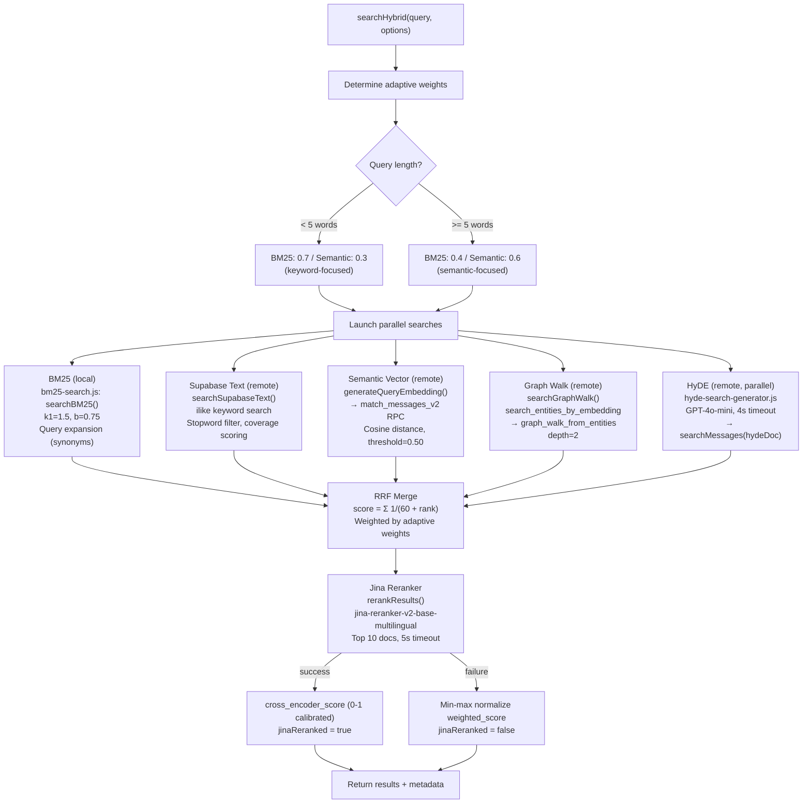
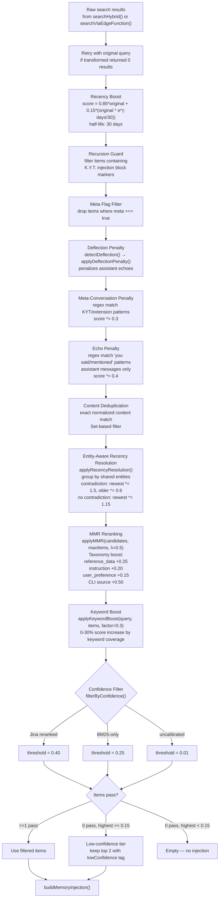
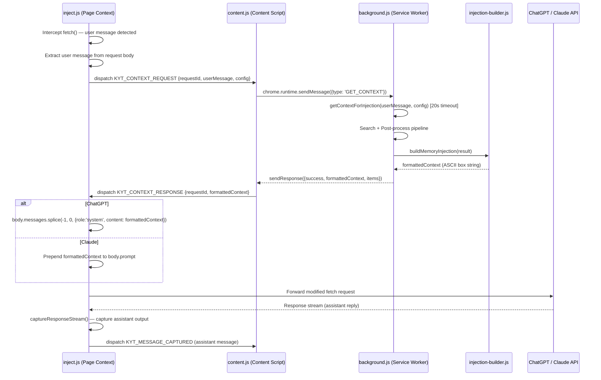
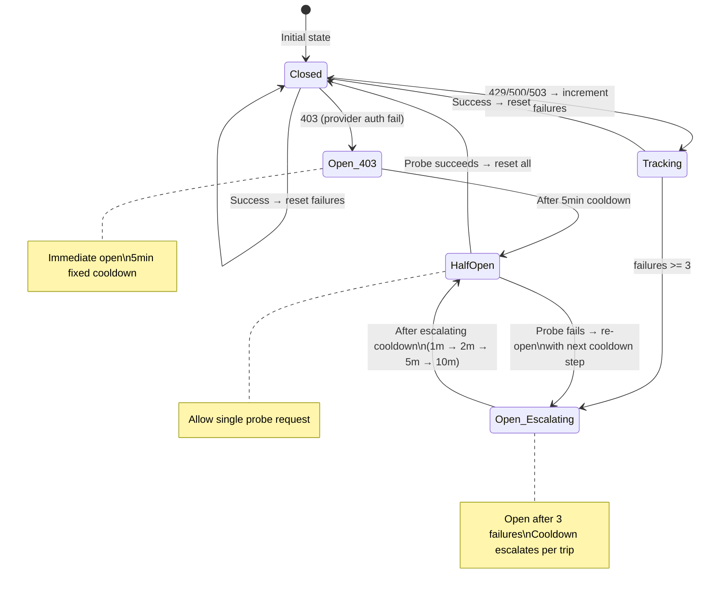

# KYT RAG Pipeline — Full Flowchart

> Visual reference for the complete data flow from user input through retrieval to context injection.
> All function names, file paths, and constants are accurate against the codebase as of 2026-02-17.

---

## 1. End-to-End Pipeline Overview



---

## 2. ChatGPT Ingestion Path

```mermaid
flowchart LR
    subgraph PAGE_CONTEXT ["PAGE_CONTEXT (inject.js)"]
        A["window.fetch override"] -->|"POST /backend-api/conversation"| B["Extract user message\nfrom body.messages[-1].content.parts[0]"]
        C["window.WebSocket override"] -->|"wss://ws.chatgpt.com"| D["Capture voice transcripts\nfrom realtime API messages"]
        E["captureResponseStream()"] -->|"SSE stream chunks"| F["Accumulate assistant\ntext deltas"]
        B --> G["stripInjectionBlock()\nremove prior K.Y.T. context"]
        D --> G
        F --> G
        G --> H["MessageDeduplicator\n(5s window, content hash)"]
        H --> I["dispatch: KYT_MESSAGE_CAPTURED"]
    end

    subgraph ISOLATED_WORLD ["ISOLATED_WORLD (content.js)"]
        I --> J["Queue Manager ready?"]
        J -->|yes| K["queueManager.capture()\n3-tier persistence"]
        J -->|no| L["Direct sendMessage()\nfallback"]
        K --> M["chrome.runtime.sendMessage\n{type: 'SAVE_MESSAGE', data}"]
        L --> M
    end

    subgraph DOM_FALLBACK ["PAGE_CONTEXT (dom-observer.js)"]
        N["MutationObserver\non conversation container"] --> O["processMessageNode()\ndata-message-author-role attr"]
        O --> P["Buffer user messages\n(1.5s merge delay)"]
        P --> Q["dispatch: KYT_DOM_MESSAGE_CAPTURED"]
        Q --> I
    end

    subgraph SERVICE_WORKER ["SERVICE_WORKER (background.js)"]
        M --> R["saveMessage()"]
        R --> S["Validate content exists"]
        S --> T["hashContent() → findDuplicate()\nscan last 200 messages"]
        T --> U["detectDeflection()\ntag echo confidence"]
        U --> V["chrome.storage.local.set\n{captured_messages}"]
        V --> W["Quota check every 50th save\nevict old if exceeded"]
    end
```



---

## 3. Claude Ingestion Path



---

## 4. Edge vs Legacy Routing



---

## 5. Parallel Search Strategy Execution



---

## 6. Post-Search Processing Pipeline (`getContextForInjection`)



---

## 7. Injection Block Insertion



---

## 8. Circuit Breaker State Machine



Three separate circuit breaker instances:
- **Embedding CB** (`kyt_embedding_circuit_breaker`) — HuggingFace/Scaleway Qwen3
- **Jina CB** (`kyt_jina_circuit_breaker`) — Jina reranker API
- **HyDE CB** (`kyt_hyde_circuit_breaker`) — OpenAI GPT-4o-mini

---

## 9. Score Evolution Through Pipeline

```
                          ┌─────────────────────────────────────────────────┐
Source Scores             │  BM25: bm25_score (TF-IDF, k1=1.5, b=0.75)    │
(parallel search)         │  Semantic: distance (cosine 0-2) via pgvector  │
                          │  Graph: graph_score (relationship_strength)     │
                          │  Text: keyword coverage (hits / totalKeywords)  │
                          └─────────────────────┬───────────────────────────┘
                                                │
                          ┌─────────────────────▼───────────────────────────┐
RRF Merge                 │  rrf_score = Σ 1/(60 + rank) per result list   │
                          │  weighted_score = rrf_score * adaptive_weight   │
                          └─────────────────────┬───────────────────────────┘
                                                │
                          ┌─────────────────────▼───────────────────────────┐
Jina Reranker             │  cross_encoder_score = relevance_score (0-1)    │
(or fallback)             │  OR min-max normalized weighted_score           │
                          └─────────────────────┬───────────────────────────┘
                                                │
                          ┌─────────────────────▼───────────────────────────┐
Recency Boost             │  score = 0.85*score + 0.15*(score * e^(-d/30)) │
                          └─────────────────────┬───────────────────────────┘
                                                │
                          ┌─────────────────────▼───────────────────────────┐
Penalties                 │  Meta-conversation: score *= 0.3               │
                          │  Echo (assistant): score *= 0.4                │
                          │  Deflection: score *= (1 - confidence)         │
                          └─────────────────────┬───────────────────────────┘
                                                │
                          ┌─────────────────────▼───────────────────────────┐
Recency Resolution        │  Contradiction detected: newest *= 1.5,        │
(entity-aware)            │                          older   *= 0.6        │
                          │  No contradiction:       newest *= 1.15        │
                          └─────────────────────┬───────────────────────────┘
                                                │
                          ┌─────────────────────▼───────────────────────────┐
MMR (λ=0.5)               │  MMR = 0.5*relevance - 0.5*max_sim_to_selected │
                          │  + taxonomy boost (+0.15 to +0.50)             │
                          └─────────────────────┬───────────────────────────┘
                                                │
                          ┌─────────────────────▼───────────────────────────┐
Keyword Boost             │  score += score * (keywordCoverage * 0.3)      │
                          └─────────────────────┬───────────────────────────┘
                                                │
                          ┌─────────────────────▼───────────────────────────┐
Confidence Gate           │  Jina reranked:  threshold = 0.40              │
                          │  BM25-only:      threshold = 0.25              │
                          │  Uncalibrated:   threshold = 0.01              │
                          │  Low tier:       >= 0.15 → top 2 with caveat  │
                          │  Below 0.15:     dropped entirely              │
                          └─────────────────────────────────────────────────┘
```

---

## 10. Key Constants Reference

| Constant | Value | File | Purpose |
|----------|-------|------|---------|
| **Embedding model** | `qwen3-embedding-8b` | `browser-sync.js`, `browser-search.js` | 4096-dim vectors |
| **Embedding URL** | `https://router.huggingface.co/scaleway/v1/embeddings` | `browser-sync.js`, `browser-search.js` | HF Router → Scaleway |
| **Jina model** | `jina-reranker-v2-base-multilingual` | `browser-search.js` | Cross-encoder reranker |
| **Jina URL** | `https://api.jina.ai/v1/rerank` | `browser-search.js` | Reranking API |
| **HyDE model** | GPT-4o-mini | `hyde-search-generator.js` | Hypothetical doc generation |
| **Query transform model** | GPT-3.5-turbo | `query-transformer.js` | Query optimization |
| **BM25 k1** | 1.5 | `bm25-search.js` | TF saturation |
| **BM25 b** | 0.75 | `bm25-search.js` | Length normalization |
| **RRF K** | 60 | `browser-search.js` | Reciprocal rank fusion constant |
| **MMR lambda** | 0.5 | `background.js` | Relevance/diversity balance |
| **Semantic threshold** | 0.50 | `background.js` | Supabase RPC match_threshold |
| **Confidence threshold (Jina)** | 0.40 | `background.js` | Calibrated score gate |
| **Confidence threshold (BM25)** | 0.25 | `background.js` | BM25-only fallback |
| **Low-confidence tier** | 0.15 | `background.js` | Keep top 2 with caveat |
| **Recency half-life** | 30 days | `background.js` | Exponential decay boost |
| **Exclude recent** | 120s | `background.js` | Context pollution prevention |
| **Sync debounce** | 5s / 30s max | `background.js` | Batch sync timing |
| **Chunk window/overlap** | 5 / 2 | `conversation-chunker.js` | Turn chunking params |
| **Embedding batch tokens** | 8000 | `browser-sync.js` | Max tokens per HF batch |
| **Messages batch size** | 5 | `browser-sync.js` | Supabase insert batch |
| **Dedup scan window** | 200 | `background.js` | Last N messages for dedup |
| **CB cooldowns (embedding)** | 1m, 2m, 5m, 10m | `embedding-circuit-breaker.js` | Escalating cooldown steps |
| **CB cooldowns (Jina)** | 1m, 2m, 5m | `embedding-circuit-breaker.js` | Escalating cooldown steps |
| **CB 403 cooldown** | 5min | `embedding-circuit-breaker.js` | Auth failure fixed cooldown |
| **Queue Manager recovery** | 5s interval | `queue-manager.js` | Retry pending messages |
| **Queue Manager CB threshold** | 5 failures | `queue-manager.js` | Open after N failures |

---

## 11. Timeout Cascade

```
Content Script (25s)
  └─ Background GET_CONTEXT handler (20s)
       ├─ Query Transformation (3s)
       │    └─ fetchRecentTopicsFromSupabase + transformQuery (GPT-3.5)
       ├─ Search Execution
       │    ├─ HuggingFace embedding (8s, 2 retries)
       │    ├─ Supabase RPC (default fetch timeout)
       │    ├─ Supabase text search (default)
       │    ├─ Graph walk (default)
       │    ├─ HyDE generation (4s, GPT-4o-mini)
       │    └─ Jina reranker (5s, 2 attempts)
       └─ Post-processing (< 50ms, all in-memory)
```

All timeouts are designed so inner operations expire before outer ones, preventing orphaned work.
