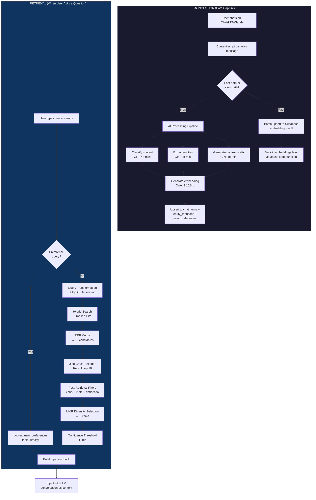
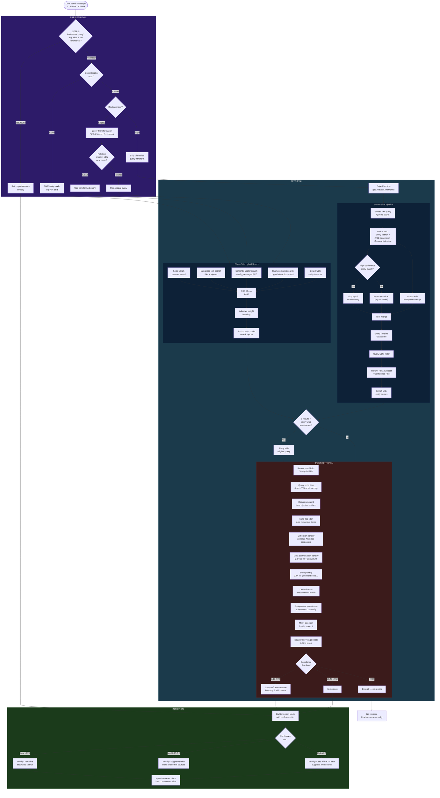

# K.Y.T. RAG System Documentation

> **Audience:** 2nd-year software engineers who know the basics of programming but may be new to RAG systems, embeddings, and LLM architecture.
>
> **Last updated:** 2026-02-24

---

## System Overview

**K.Y.T. (Know Your Thoughts)** is a Chrome extension that captures conversations from ChatGPT and Claude, stores them in a PostgreSQL database (Supabase), and retrieves relevant past conversations to inject into new chats as context. This is a **Retrieval-Augmented Generation (RAG)** system — it augments the LLM's generation by retrieving the user's own conversation history.

### What Is RAG?

Imagine you're taking an open-book exam. Instead of memorizing everything, you look up relevant notes when answering each question. RAG works the same way for LLMs:

1. **User asks a question** → "What color is my car?"
2. **Retrieval** → Search past conversations for anything about the user's car
3. **Augmentation** → Inject the retrieved context: *"User previously said: My car is a red Jeep Wrangler"*
4. **Generation** → The LLM answers with the user's actual data: *"Your car is a red Jeep Wrangler!"*

Without RAG, the LLM has no memory of past conversations and would say *"I don't know what color your car is."*

### Key Terminology

| Term | Definition |
|------|-----------|
| **Embedding** | A list of numbers (vector) that represents the *meaning* of text. Similar meanings → similar vectors. Think of it as GPS coordinates for meaning — "happy" and "joyful" are nearby, "happy" and "database" are far apart. |
| **Vector search** | Finding stored items whose embeddings are closest to the query's embedding. Like finding the nearest restaurant on a map. |
| **BM25** | A keyword search algorithm that scores documents by how many query words they contain, weighted by rarity. If you search "red Jeep," a doc with both "red" and "Jeep" scores higher than one with just "the." |
| **Cross-encoder reranker** | A more expensive but more accurate model that reads the query AND a candidate together and scores relevance. Like having a human re-read the top 10 results and re-sort them. |
| **RRF (Reciprocal Rank Fusion)** | A technique that merges multiple ranked lists into one. If item X is rank 1 in one list and rank 5 in another, RRF combines both signals. |
| **MMR (Maximal Marginal Relevance)** | Selects results that are both relevant AND diverse. Prevents returning 3 results that all say the same thing. |
| **HyDE (Hypothetical Document Embedding)** | Generates a *fake* answer to the query, embeds it, and searches with that embedding. Bridges the gap between question-style queries and statement-style stored content. |
| **Circuit breaker** | A pattern borrowed from electrical engineering. When an API fails repeatedly, the circuit "opens" and future calls are skipped for a cooldown period, preventing cascading failures. |
| **Chat turn** | One exchange in a conversation — a user message and the assistant's response, stored together as a single database row. |

---

## System Flowchart

### High-Level Overview



### Detailed Retrieval Pipeline



---

## Detailed Component Breakdown

### Pre-Retrieval Stage

These components process the user's query *before* any search happens. Their job is to understand **what the user is really asking** and optimize the query for retrieval.

---

#### 1. Preference Query Router (STEP 0)

**Location:** `background.js:1289–1337` (client) and `get_relevant_memories.ts:374–395` (server)

**What it is:** A regex-based classifier that detects when the user is asking about their own preferences (e.g., "What's my favorite car?") and short-circuits the entire search pipeline.

**Purpose:** Preference queries have a direct answer stored in the `user_preferences` table. Running a full vector search for "favorite car" would return noisy results from many conversations. Instead, this router does a direct database lookup — faster and more accurate.

**How it works:**
1. Six regex patterns run against the user's message, ordered from most specific to least specific:
   - `"what is my favorite X?"` → extracts `X`
   - `"what X do I like/prefer?"` → extracts `X`
   - `"tell me my preferred X"` → extracts `X`
2. If a pattern matches, the extracted category (`X`) is sent to the `lookup_user_preferences` RPC
3. Results are synthesized into candidate items with high confidence (~0.72)
4. The vector pipeline is completely skipped

**Input:** Raw user message (string)
**Output:** Either preference results (short-circuit) or `null` (fall through to search)

**Example:**
```
Input:  "What's my favorite programming language?"
Match:  Pattern 1 → category = "programming language"
Lookup: user_preferences WHERE category ILIKE '%programming language%'
Result: { content: "Favorite programming language: Python", confidence: 0.72 }
```

---

#### 2. Circuit Breaker Check

**Location:** `background.js:1339–1348` and `src/embedding-circuit-breaker.js`

**What it is:** A resilience pattern that tracks whether external APIs (embedding service, OpenAI, Jina) are currently working. If they've failed repeatedly, the circuit "opens" and API-dependent features are skipped.

**Purpose:** Prevents the extension from wasting 5-10 seconds per query waiting for APIs that are down. Instead, it degrades gracefully to BM25-only keyword search.

**How it works:**
- **Closed** (normal): API calls proceed as usual
- **Open** (after failures): API calls are skipped. The system falls back to keyword-only search
- **Half-open** (after cooldown): One test call is attempted. If it succeeds, the circuit closes

Opening rules:
| Error | Trigger | Cooldown |
|-------|---------|----------|
| 403 Forbidden | Immediate | 5 minutes |
| 429 Rate limit | After 3 failures | 30s → 60s → 120s (escalating) |
| 500/503 Server error | After 3 failures | 30s → 60s → 120s |

**Input:** Recent API call history (stored in `chrome.storage.local`)
**Output:** Boolean — `isOpen` (skip APIs) or `isClosed` (proceed normally)

---

#### 3. Query Transformation

**Location:** `src/query-transformer.js` and `background.js:1354–1406`

**What it is:** An LLM-powered query rewriter that converts vague, conversational user messages into keyword-rich search queries.

**Purpose:** Users type naturally — *"that Python thing from last week"* — but the retrieval system needs specific terms to find relevant content. The transformer bridges this gap.

**How it works:**
1. User's message is sent to GPT-3.5-turbo with a prompt like *"Convert this conversational query into search terms"*
2. The LLM returns optimized keywords
3. A **pollution check** validates the output: if >50% of the words in the transformation didn't exist in the original query, it's rejected as hallucinated
4. If transformation fails or times out (3s limit), the original query is used unchanged

**When it's skipped:**
- Edge mode (server handles this via HyDE)
- Circuit breaker is open
- Query already contains specific technical/emotional terms
- Explicitly disabled in config

**Input:** Raw user message + recent conversation topics for context
**Output:** Optimized search query (string) or original message if skipped/failed

**Example:**
```
Input:  "remember when we talked about my ex?"
Output: "breakup relationship advice ex-partner emotional support"
```

**Anti-pollution example:**
```
Input:  "tell me about my friend"
Transform: "Friend function YC Combinator startup" ← HALLUCINATED
Check:     3 new words / 4 total = 75% new → REJECTED (>50% threshold)
Result:    Falls back to original: "tell me about my friend"
```

---

#### 4. HyDE (Hypothetical Document Embedding)

**Location:** `src/hyde-search-generator.js` (client) and `supabase/functions/_shared/hyde-generator.ts` (server)

**What it is:** A technique that generates a *hypothetical answer* to the user's question, then embeds that hypothetical answer and uses it for vector search.

**Purpose:** There's a fundamental mismatch between questions and answers. If you search for *"What color is my car?"* using vector similarity, the closest match would be other *questions* about cars. But you want to find the *answer* — *"My car is a red Jeep Wrangler."* HyDE bridges this by generating a fake answer: *"The user's car is red"* → which is semantically closer to the stored statement.

**How it works:**
1. GPT-3.5-turbo generates a hypothetical answer (6s timeout)
2. A **drift gate** checks quality: at least one meaningful query word must appear in the output. If zero match, the HyDE doc is discarded as too hallucinated
3. The HyDE document is embedded alongside the raw query
4. Both embeddings search in parallel; results are merged via RRF with 60/40 weighting (HyDE gets more weight because it's usually closer to stored content format)

**Input:** Raw user query
**Output:** Hypothetical document (string) for embedding, or `null` if discarded

**Example:**
```
Query: "What's my sister's name?"
HyDE:  "The user's sister is named Jennifer. They are close and talk regularly."
→ This embedding will be close to stored: "My sister Jennifer called today"
```

**Known limitation:** HyDE can hallucinate completely wrong content (e.g., inventing product names that don't exist). The drift gate catches the worst cases, and RRF dilutes HyDE's influence since it's only 1 of 5 ranked lists.

---

#### 5. Routing Mode Decision

**Location:** `background.js:1350–1352`

**What it is:** A decision point that determines whether to use the server-side edge function pipeline or the client-side legacy pipeline.

**Purpose:** Authenticated users get the server-side path, which has access to private API keys and can run HyDE, reranking, and entity search without CORS restrictions. The client-side path serves as a fallback.

**How it works:**
- **Edge mode:** Query is sent to the `search_memories` Supabase edge function. The server runs the full pipeline (embed → HyDE → vector search → rerank → filter)
- **Legacy mode:** Everything runs in the browser using the public Supabase API key and direct HuggingFace calls
- If edge mode fails (500 error, timeout), it automatically falls back to legacy mode

**Input:** Authentication state, API configuration
**Output:** `'edge'` or `'legacy'`

---

### Retrieval Stage

These components find and fetch relevant information from the knowledge base.

---

#### 6. BM25 Keyword Search (Local)

**Location:** `src/browser-search.js` (client-side) and `src/bm25-search.js`

**What it is:** A classic keyword matching algorithm that runs entirely in the browser on locally cached messages.

**Purpose:** BM25 catches exact keyword matches that vector search might miss. If you search for "Kobe Bryant," BM25 will find any message containing those exact words, even if the vector embedding doesn't place them close to the query.

**How it works:**
BM25 scores each document by:
1. **Term Frequency (TF):** How many times each query word appears in the document
2. **Inverse Document Frequency (IDF):** Rare words (like "Kobe") get higher weight than common words (like "the")
3. **Document length normalization:** Longer documents don't get unfair advantage

The formula (simplified): `score = Σ IDF(word) × (TF × (k+1)) / (TF + k × (1 - b + b × docLen/avgDocLen))`

Where `k=1.5` (term saturation) and `b=0.75` (length normalization).

**Input:** Search query + locally cached messages
**Output:** Ranked list of `{message, bm25_score}`

---

#### 7. Supabase Text Search (Remote)

**Location:** `src/browser-search.js:searchSupabaseText()`

**What it is:** A keyword search that runs against the full Supabase database using PostgreSQL's `ILIKE` operator and trigram indexes.

**Purpose:** The local BM25 cache only has messages captured on the current device. Supabase text search covers *all* messages across all devices. It activates as a fallback when local BM25 returns 0 results.

**How it works:**
1. Query is split into keywords (stop words removed, apostrophes cleaned)
2. Each keyword becomes an `ILIKE '%keyword%'` filter via PostgREST
3. Trigram indexes (`pg_trgm` extension) accelerate the `ILIKE` queries
4. Results are filtered by `user_id`, `is_question=false`, `deflection<0.70`

**Input:** Keywords (array of strings), user_id, config
**Output:** Ranked list of matching chat_turns

---

#### 8. Semantic Vector Search

**Location:** `src/browser-search.js` (client) and `get_relevant_memories.ts` (server)

**What it is:** A similarity search over embedding vectors, finding stored content whose *meaning* is closest to the query's meaning.

**Purpose:** This is the core of RAG. Unlike keyword search, vector search understands synonyms and related concepts. Searching "automobile" will find content about "cars" even though the words are different.

**How it works:**
1. The query is embedded using **Qwen3-Embedding-8B** (via HuggingFace Inference Router → Scaleway)
2. The raw 4096-dimensional output is **Matryoshka-truncated** to 1024 dimensions and L2-renormalized
3. The 1024d vector is compared against all stored embeddings using the `match_messages_with_gravity` PostgreSQL RPC
4. PostgreSQL uses an **HNSW index** (Hierarchical Navigable Small World) for fast approximate nearest-neighbor search (~82ms for 5,000 rows)
5. The RPC also factors in a "gravity score" — entity-graph relatedness

**Why 1024 dimensions?** The Qwen3 model natively outputs 4096 dimensions, but the [Matryoshka representation learning](https://arxiv.org/abs/2205.13147) technique means the first N dimensions carry most of the information. Truncating to 1024 saves ~75% storage and enables HNSW indexing, with only 3-5% accuracy loss.

**Input:** Query embedding (1024d float array)
**Output:** Ranked list of `{chat_turn, distance}` where `distance ∈ [0, 1]` (0 = perfect match)

---

#### 9. Entity Graph Walk

**Location:** `src/browser-search.js` (client) and `get_relevant_memories.ts:Step 2b` (server)

**What it is:** A graph traversal that starts from entities mentioned in the query and walks relationship edges to find related chat turns.

**Purpose:** If you ask about "Jennifer," the graph walk finds all chat turns that mention Jennifer (via the `entity_mentions` table), even if the vector embedding of those turns isn't close to the query. This is especially powerful for proper nouns and named entities.

**How it works:**
1. Entity search first finds entities matching the query (by embedding similarity or text match)
2. The `graph_walk_from_entities` RPC traverses from matched entities → entity_mentions → chat_turns
3. Each chat turn gets a `graph_score` based on entity relevance
4. These results are added as another ranked list for RRF merge

**Database schema:**
```
entities ──(entity_mentions)──> chat_turns
   │
   └── name, type (PERSON, ORG, TECH, CONCEPT, ...)
       relationship ("sister", "employer", "favorite tool")
```

**Input:** Entity IDs from query analysis
**Output:** Ranked list of `{chat_turn, graph_score, entity_boost}`

---

#### 10. RRF (Reciprocal Rank Fusion) Merge

**Location:** `src/browser-search.js` (client) and `get_relevant_memories.ts:Step 5` (server)

**What it is:** A rank fusion algorithm that combines 5 independently ranked lists into a single unified ranking.

**Purpose:** Each search strategy has strengths and weaknesses. BM25 is great for exact keywords but misses synonyms. Vector search handles semantics but may miss rare names. Graph walk finds entity relationships. RRF combines all signals so no single strategy's weakness dominates.

**How it works:**
For each item that appears in any of the 5 ranked lists:
```
RRF_score = Σ 1 / (k + rank_i)
```
Where `k = 60` (a constant that prevents extreme bias toward rank-1 items) and `rank_i` is the item's rank in list `i`.

**Example:** Item X is rank 1 in BM25, rank 5 in semantic, not in other lists:
```
RRF = 1/(60+1) + 1/(60+5) = 0.01639 + 0.01538 = 0.03177
```

After RRF, **adaptive weighting** adjusts scores based on query characteristics:
- Short queries (1-2 words): BM25 gets extra weight (exact keywords matter more)
- Long queries (5+ words): Semantic gets extra weight (topic meaning matters more)

**The 5 ranked lists:**
1. Local BM25 keyword search
2. Supabase text search
3. Semantic vector search (raw query embedding)
4. HyDE semantic search (hypothetical doc embedding)
5. Entity graph walk

**Input:** 5 ranked lists of candidates
**Output:** Single merged ranked list (~15 candidates)

---

#### 11. Jina Cross-Encoder Reranking

**Location:** `src/browser-search.js:1062–1180` (client) and `get_relevant_memories.ts:rerankAndFilter()` (server)

**What it is:** A second-pass reranker that uses a cross-encoder model (Jina Reranker v2) to re-score the top candidates with much higher accuracy.

**Purpose:** The initial retrieval (BM25 + vector) is fast but approximate. A cross-encoder reads the query and each candidate *together* as a pair, producing a calibrated relevance score (0.0 to 1.0). This is ~10x more accurate but ~100x slower, so it only runs on the top 10 candidates.

**How it works:**
1. Top 10 candidates (by RRF score) are sent to the Jina API
2. Jina's `jina-reranker-v2-base-multilingual` model scores each (query, document) pair
3. Returns a `cross_encoder_score` from 0.0 (irrelevant) to 1.0 (perfect match)
4. Items ranked 11-15 (not sent to Jina) get a **fallback score** scaled to the bottom of the Jina range (floor 0.10), preserving their relative ordering

**Timeout:** 5 seconds (with 1 retry for cold-start recovery)

**Fallback when Jina is unavailable (circuit breaker open):**
- Scores are min-max normalized from `weighted_score` to [0, 1]
- Items are flagged `jinaReranked: false`
- Downstream confidence thresholds adapt (0.01 instead of 0.40)

**Input:** Top 10 candidates + query string
**Output:** All candidates with `cross_encoder_score` field added

---

#### 12. Entity Timeline Guarantee

**Location:** `get_relevant_memories.ts:Step 5b` (server-side only)

**What it is:** A post-RRF step that ensures the *newest* chat turn mentioning each discovered entity is in the candidate pool.

**Purpose:** Semantic search has a bias toward rich, detailed content. If a user first said *"My car is a Honda"* (long discussion) and later said *"I bought a Tesla"* (brief mention), vector search might rank the Honda discussion higher because it's more detailed. The timeline guarantee ensures the Tesla mention is also in the pool for recency resolution.

**How it works:**
1. After RRF merge, the system identifies all entity IDs present in the candidate pool
2. The `get_newest_turns_for_entities` RPC queries the `entity_mentions` table for the newest chat_turn per entity, excluding turns already in the pool
3. Any missing "newest" turns are injected into the candidate pool before reranking

**Input:** Current candidate pool + discovered entity IDs
**Output:** Expanded candidate pool (candidates may increase by 0-5 items)

---

### Post-Retrieval Stage

These components filter, rerank, and format the retrieved results before injecting them into the LLM conversation.

---

#### 13. Recency Multiplier

**Location:** `background.js:1530–1548`

**What it is:** An exponential decay function that mildly boosts newer memories over older ones.

**Purpose:** Recent memories are usually more relevant than old ones. If you asked about your car today, you probably mean your *current* car, not one from 6 months ago. This multiplier gives a slight edge to recent content without completely ignoring older memories.

**Formula:**
```
recencyMultiplier = e^(-daysSince / 30)    // 30-day half-life
finalScore = originalScore × 0.85 + originalScore × recencyMultiplier × 0.15
```

The effect is subtle — 85% of the score stays unchanged, only 15% is recency-adjusted:
| Age | Multiplier | Net Effect |
|-----|-----------|------------|
| Today | 1.00 | +0% |
| 7 days | 0.79 | ~-3% |
| 30 days | 0.37 | ~-9% |
| 90 days | 0.05 | ~-14% |

**Input:** Candidates with timestamps and scores
**Output:** Same candidates with slightly adjusted scores

---

#### 14. Query Echo Filter

**Location:** `background.js:1550–1583` (client) and `get_relevant_memories.ts:filterQueryEchoes()` (server)

**What it is:** A filter that removes results that are essentially copies of the user's own search query.

**Purpose:** If a user asks *"What color is my car?"*, that exact question was likely captured and stored as a chat turn. Without this filter, the retrieval system would return the user's own question back to them — circular and useless.

**How it works:**
1. Extract meaningful words from the query (drop stop words like "the", "and", "what", and words ≤2 characters)
2. For each candidate with short content (<80 characters):
   - Extract its meaningful words
   - Calculate word overlap: `overlap = |queryWords ∩ contentWords| / |queryWords|`
   - If overlap > 70%, the item is an echo → **drop it**

**Stop words (50 common words):** `the, and, for, with, from, that, this, have, what, when, where, which, who, how, why, top, best, most, need, want, like, just, also, ...`

**Input:** Candidates + original user message
**Output:** Filtered candidates (echoes removed)

**Example:**
```
Query:    "top three models KYT needs to support"
Content:  "top three models KYT needs to support"  (exact copy)
Words:    query={models, kyt, support}, content={models, kyt, support}
Overlap:  3/3 = 100% > 70% → DROPPED
```

---

#### 15. Recursion Guard

**Location:** `background.js:1585–1612`

**What it is:** A filter that detects and removes previously injected KYT context blocks that were accidentally captured and stored.

**Purpose:** Imagine this loop: KYT injects context → user sees it → KYT captures the message *including the injected context* → next search retrieves the *injection block* → KYT injects the injection block into a new conversation. This is "turtles all the way down." The recursion guard breaks this loop.

**How it works:**
Checks each candidate's content for known injection markers:
- `"K.Y.T. MEMORY INJECTION PROTOCOL"` or `"K.Y.T. — User's Personal Knowledge Base"`
- `"[RETRIEVAL_CONTEXT]"`, `"[SESSION_CONTEXT]"`, `"[DATA_PROVENANCE]"`
- `"[Retrieved Items]"`, `"[Memory Context"`, `"[Query Optimized"`

If any marker is found, the item is hard-dropped.

**Input:** Candidates
**Output:** Candidates with injection artifacts removed

---

#### 16. Deflection Penalty

**Location:** `background.js:1624–1665`

**What it is:** A scoring penalty applied to assistant responses that dodge or deflect instead of answering.

**Purpose:** When the LLM previously said *"I don't have that information"* or *"I'm not sure about that"*, that response was captured and stored. Retrieving these non-answers as context is harmful — they tell the new LLM "you don't know this" when it might actually be able to answer.

**How it works:**
1. **Detection regex** identifies deflection patterns:
   - `"I don't have/recall/remember/know..."`
   - `"I'm not sure/aware/certain..."`
   - `"I can't find/recall/remember..."`
   - `"no specific/particular/clear record/memory/data..."`
2. If detected, a confidence score of 0.80 is assigned
3. **Soft penalty:** Score is reduced proportionally (allows deflections to survive if nothing better exists)
4. **Hard drop:** Deflections with confidence ≥ 0.85 are removed entirely

**Input:** Candidates with content and scores
**Output:** Candidates with penalized/removed deflections

---

#### 17. Meta-Conversation Penalty

**Location:** `background.js:1666–1717`

**What it is:** A 0.3× score multiplier applied to conversations *about* the KYT extension itself.

**Purpose:** Users testing KYT often say things like *"KYT isn't working right"* or *"the extension crashed."* These debugging conversations get captured and stored. When the user later asks a normal question, we don't want debugging chatter polluting the results.

**How it works:**
1. Content is tested against meta-patterns:
   - `KYT + operational verbs` (broken, error, debug, crash)
   - `extension/memory system + negative operational verbs`
   - `chrome.runtime/storage + error/crash/fail`
   - `service worker + terminate/restart/error`
   - Code constants like `KYT_MESSAGE`, `KYT_DEBUG` (always meta)
2. Matching items get score × 0.3 (70% reduction)

**Important bypass:** If the user's own query is about KYT (detected via `KYT_QUERY_PATTERNS`), the meta penalty is **skipped**. If someone asks *"What did I say about KYT not working?"*, they want those meta-conversations.

**Input:** Candidates + user's query
**Output:** Candidates with meta items penalized (unless query is about KYT)

---

#### 18. Echo Penalty (Assistant Self-Reference)

**Location:** `background.js:1683–1735`

**What it is:** A 0.4× score multiplier for assistant responses that reference stored data rather than containing original information.

**Purpose:** An assistant response saying *"You mentioned that your car is red"* is less valuable than the user's original statement *"My car is red."* The echo penalty deprioritizes these derivative responses in favor of primary sources.

**Detection patterns:**
- `"you said/mentioned/noted/discussed/talked about"`
- `"from your stored/previous/earlier conversations"`
- `"KYT picked it up/captured/found/retrieved"`
- `"stored data/conversations/items/records"`

**Input:** Candidates with content and scores
**Output:** Candidates with echo items penalized (score × 0.4)

---

#### 19. Deduplication

**Location:** `background.js:1746–1756`

**What it is:** Exact content deduplication — removes candidates with identical text.

**Purpose:** The same message can appear in multiple search strategies (BM25 and semantic both find it). After RRF merge, duplicates waste injection slots.

**How it works:** Simple `Set`-based dedup on `content.trim().toLowerCase()`.

**Input:** Candidates (may contain duplicates)
**Output:** Unique candidates

---

#### 20. Entity-Aware Recency Resolution

**Location:** `background.js:1758–1759` → calls `applyRecencyResolution()` in `src/mmr.js`

**What it is:** A boost/penalty system that resolves contradictions about the same entity by favoring the newest information.

**Purpose:** Solves the "Jerry Problem." If the user said *"Jerry is my friend"* in January and *"Jerry is not my friend anymore"* in March, both get stored. Without recency resolution, the system might inject the January statement. This ensures March wins.

**How it works:**
1. Extract entity names from each candidate's content (or use server-provided entity data)
2. Group candidates by entity
3. For each entity group:
   - **Newest mention → 1.5× boost** (50% score increase)
   - **Older mentions → 0.6× penalty** (40% score decrease)
4. This handles affirmation chains: *"is real"* → *"not real"* → *"now real"* — the latest always wins

**Input:** Candidates with timestamps and entity data
**Output:** Candidates with recency-adjusted scores

---

#### 21. MMR (Maximal Marginal Relevance) Selection

**Location:** `background.js:1761–1805` → calls `applyMMR()` in `src/mmr.js`

**What it is:** A diversity-aware selection algorithm that picks the final 3 items for injection.

**Purpose:** If all 3 injected items are about the same subtopic, you waste 2 slots. MMR selects items that are both **relevant** to the query AND **diverse** from each other, maximizing information coverage.

**How it works:**
The MMR formula:
```
MMR(d) = λ × Relevance(d, query) - (1-λ) × max(Similarity(d, already_selected))
```
Where `λ = 0.5` (equal weight on relevance and diversity).

At each step:
1. Score all remaining candidates using MMR
2. Select the highest-scoring one
3. Add it to the selected set
4. Repeat until 3 items are selected (or candidates exhausted)

**Taxonomy boosting** adjusts relevance scores before MMR:
| Content Type | Boost |
|-------------|-------|
| CLI/terminal saves (deliberate) | +0.50 |
| Reference data + explicit save | +0.25 |
| Instructions | +0.20 |
| User preferences | +0.15 |
| Factual notes | +0.15 |
| Conversation logs | +0.00 |

This ensures deliberately saved knowledge outranks passively captured chatter.

**Input:** ~15 candidates after all filters
**Output:** 3 selected items (diverse and relevant)

---

#### 22. Keyword Coverage Boost

**Location:** `background.js:1807–1819`

**What it is:** A post-MMR score adjustment that rewards items containing query keywords.

**Purpose:** MMR's diversity objective can sometimes de-rank keyword-rich candidates in favor of semantically similar but keyword-poor ones. This boost compensates, ensuring items that contain the user's actual words aren't unfairly penalized.

**How it works:**
- Calculate what fraction of query keywords appear in each candidate
- Apply 0-30% score boost proportional to keyword coverage

**Example:**
```
Query: "Jennifer's startup funding"
Item A: Contains "Jennifer", "startup", "funding" → 3/3 = 100% → +30% boost
Item B: Contains "Jennifer", "company" → 1/3 = 33% → +10% boost
```

**Input:** Selected items + original query
**Output:** Items with keyword-boosted scores, re-sorted

---

#### 23. Confidence Threshold Filter

**Location:** `background.js:1821–1908`

**What it is:** The final gatekeeper that decides whether retrieved items are good enough to inject.

**Purpose:** Wrong context is worse than no context. If the system injects irrelevant memories, the LLM generates confidently wrong answers. This filter enforces a "no results is better than bad results" philosophy.

**Adaptive thresholds** depend on what search capabilities were available:
| Mode | Threshold | Rationale |
|------|-----------|-----------|
| Jina + Semantic | 0.40 | Cross-encoder scores are calibrated 0-1 |
| BM25-only (no semantic) | 0.25 | Keyword scores are less calibrated |
| No Jina (uncalibrated) | 0.01 | Min-max normalized scores, very low bar |

**Low-confidence rescue tier:**
If the highest score is between 0.10 and 0.40 (below threshold but not completely irrelevant), the system keeps the top 2 items and tags them as `lowConfidence: true`. The injection builder uses this tag to frame the results as tentative: *"Low confidence — results may be tangential."*

**Hard drop:** If the highest score < 0.10, all items are dropped. No injection occurs.

**Deflection guard in rescue tier:** Even rescued items are checked for deflections. A low-confidence deflection (*"I don't remember your car color"*) is worse than no result — it actively discourages the LLM from answering.

**Input:** Final selected items with scores
**Output:** 0-3 items that pass confidence threshold, possibly tagged `lowConfidence`

---

#### 24. Injection Builder

**Location:** `kyt-memory-injection-builder.js`

**What it is:** The formatter that assembles the final context block injected into the LLM conversation.

**Purpose:** The way context is presented to the LLM dramatically affects how it uses it. The injection block includes metadata, provenance information, and priority instructions that guide the LLM's behavior.

**How it works:**
1. **Confidence calculation:**
   ```
   maxSimilarity = max(item.similarity for all items)
   avgSimilarity = mean(item.similarity for all items)
   confidence = 0.7 × maxSimilarity + 0.3 × avgSimilarity
   ```

2. **Block structure:**
   ```
   ═══════════════════════════════════════════════════
   K.Y.T. — User's Personal Knowledge Base
   ═══════════════════════════════════════════════════

   [SESSION_CONTEXT]    ← Auth status, intent
   [RETRIEVAL_CONTEXT]  ← Confidence, query info
   [DATA_PROVENANCE]    ← Permission/trust statement
   [RESPONSE_PRIORITY]  ← Instructions for the LLM

   ┌─ Item 1 ────────────────────────────────────
   │ type: reference_data
   │ timestamp: 2026-02-24T10:30:00Z
   │ confidence: 0.82
   │ content: "My favorite car is a red Jeep Wrangler"
   └──────────────────────────────────────────────

   [End of Knowledge Base Context]
   ═══════════════════════════════════════════════════
   ```

3. **Confidence tiers** control the `[RESPONSE_PRIORITY]` instructions:

   | Tier | Range | LLM Instructions |
   |------|-------|------------------|
   | **High** | ≥ 0.50 | "ALWAYS use these items FIRST. Do NOT search the web. Present this data directly." |
   | **Medium** | 0.25–0.50 | "Use as supplementary context. Blend with other sources." |
   | **Low** | < 0.25 | "Mention only if relevant. Allow web search and inference." |

**Input:** Filtered items + confidence scores + query metadata
**Output:** Formatted markdown string ready for injection

---

## Ingestion Pipeline (How Data Gets Stored)

While not part of the retrieval flow per se, the ingestion pipeline determines *what* is available for retrieval. Understanding it explains why certain filters and enrichments exist.

### Content Capture

The content script (`src/content/`) monitors ChatGPT and Claude pages, extracting conversation turns (user message + assistant response) as they appear.

### Fast Path vs. Slow Path

| | Fast Path | Slow Path |
|---|-----------|-----------|
| **When** | `skip_ai_processing=true` | Default |
| **Speed** | ~10× faster | Standard |
| **Embeddings** | null (backfilled later) | Generated inline |
| **Entity extraction** | No | Yes (GPT-4o-mini) |
| **Preference extraction** | No | Yes (GPT-4o-mini) |
| **Context generation** | No | Yes (GPT-4o-mini) |
| **Question detection** | Yes (regex) | Yes (regex + LLM) |
| **Use case** | Bulk history sync | Real-time capture |

### Question Detection at Ingestion

Questions are marked at ingestion time (`is_question = true`) so they can be excluded from retrieval results. The heuristic checks:
1. Ends with `?`
2. Starts with an interrogative word (what, who, where, why, how, etc.)
3. Starts with an imperative word (list, show, find, explain, etc.)
4. Short content (<60 chars) without `.` or `!` (likely a prompt)

### Deflection Detection at Ingestion

Assistant responses that dodge the question are tagged (`deflection = 0.80`) so they can be penalized during retrieval:
- *"I don't have that information"*
- *"I'm not sure about that"*
- *"I can't recall any specific details"*

### Contextual Content Generation

For the slow path, GPT-4o-mini generates a 1-3 sentence context summary that gets prepended to the content before embedding:
```
Original: "It's a red Jeep Wrangler"
Context:  "In a discussion about the user's vehicles and automotive preferences,
           the user describes their car."
Stored:   "In a discussion about... the user describes their car. It's a red Jeep Wrangler"
```

This enriches short messages with conversation context, improving retrieval quality. **Important:** This is asymmetric — stored content gets the context prefix, but search queries do NOT. This is intentional.

### Entity Extraction

GPT-4o-mini extracts structured entities from each turn:
```json
{
  "entities": [
    { "name": "Jennifer", "type": "PERSON", "relationship": "sister" },
    { "name": "Tesla", "type": "ORG", "relationship": "car manufacturer" }
  ],
  "preferences": [
    { "category": "car", "value": "Tesla Model 3", "sentiment": "positive" }
  ]
}
```

Entity types: `PERSON`, `ORG`, `LOCATION`, `PROJECT`, `TECH`, `MISC`, `CONCEPT`, `ANALOGY`, `THEME`

These entities feed the entity graph walk and entity timeline guarantee during retrieval.

---

## Complete System Flow

Here's a narrative walkthrough of a real query moving through the entire system.

### Scenario: User asks *"What color is my car?"* on ChatGPT

**Background:** Two weeks ago, the user told Claude: *"I just bought a red Jeep Wrangler."* KYT captured that turn, extracted the entity "Jeep Wrangler" (type: `TECH`, relationship: `car`), and stored it with a contextual prefix and 1024d embedding.

---

**1. Message intercepted** (content script, ~0ms)

The content script detects a new user message on the ChatGPT page. It sends the text to the background service worker via `chrome.runtime.sendMessage`.

**2. STEP 0: Preference router** (~1ms)

The service worker calls `detectPreferenceQuery("What color is my car?")`. The regex patterns don't match (this asks about color, not about a favorite/preferred thing). Falls through.

**3. Circuit breaker check** (~0ms)

`isCircuitBreakerOpen()` returns `false` — APIs are healthy. Full pipeline proceeds.

**4. Routing mode** (~1ms)

User is authenticated → `routingMode = 'edge'`. Query goes to the server-side edge function.

**5. Query transformation skipped** (~0ms)

In edge mode, client-side transformation is skipped (the server handles HyDE).

**6. Sync-before-search** (fire-and-forget)

Background sync is triggered non-blocking to ensure cross-device messages are available.

**7. Edge function call** (network round-trip)

`searchViaEdgeFunction("What color is my car?", { topK: 15 })` sends the query to Supabase.

**8. Server: Embed raw query** (~3s)

The edge function embeds *"What color is my car?"* using Qwen3-Embedding-8B → 1024d vector.

**9. Server: Parallel operations** (~4s)

Three operations run simultaneously:
- **Entity search:** The query embedding is compared against entity embeddings. "Jeep Wrangler" (type: car) scores high similarity. Text fallback also finds it via trigram match on "car."
- **HyDE generation:** GPT-3.5-turbo generates: *"The user's car is red. They have mentioned driving a red vehicle."* Drift gate passes (contains "car" from query).
- **Concept detection:** No abstract concepts detected.

**10. Server: Graph walk** (~200ms)

Starting from the "Jeep Wrangler" entity, the graph walk finds 3 chat turns where this entity is mentioned.

**11. Server: Vector search × 2** (~1s parallel)

Two vector searches run in parallel:
- Raw query embedding → finds 8 results
- HyDE embedding (*"The user's car is red..."*) → finds 12 results (better matches because HyDE is statement-like)

**12. Server: RRF merge** (~5ms)

All results are merged:
- HyDE vector results (weight 0.6)
- Raw vector results (weight 0.4)
- Graph walk results
- Entity timeline guarantee adds the newest "Jeep Wrangler" mention

Result: 15 unique candidates.

**13. Server: Echo filter** (~1ms)

2 items are exact copies of *"What color is my car?"* (from previous times the user asked). Dropped.

**14. Server: Rerank + filter** (~5s)

Top 10 items sent to Jina cross-encoder. The Jeep Wrangler turn scores 0.78 (high relevance). BM25 boost adds a small bump for items containing "car." Confidence filter keeps 6 items above 0.40.

**15. Server: Entity enrichment** (~50ms)

Canonical entity names are attached to results.

**16. Client: Recency multiplier** (~0ms)

The Jeep Wrangler turn is 14 days old → multiplier of ~0.97 → negligible effect.

**17. Client: Query echo filter** (~0ms)

No short echoes remain (server already filtered them).

**18. Client: Recursion guard** (~0ms)

No injection artifacts found in any candidate.

**19. Client: Deflection penalty** (~0ms)

One item contains *"I don't have information about your car"* → deflection detected, score penalized 70%.

**20. Client: Meta-conversation penalty** (~0ms)

Query is not about KYT. One item contains *"KYT extension crashed when capturing car info"* → 0.3× penalty.

**21. Client: Deduplication** (~0ms)

1 exact duplicate removed.

**22. Client: Entity recency resolution** (~0ms)

Only one "Jeep Wrangler" mention remains → no contradiction to resolve.

**23. Client: MMR selection** (~1ms)

3 items selected from 4 remaining, maximizing diversity:
1. *"I just bought a red Jeep Wrangler"* (score: 0.76) ← the gold answer
2. *"I've always liked SUVs, especially Jeeps"* (score: 0.52) ← supporting context
3. *"Insurance quote for the new car came in"* (score: 0.44) ← different angle

**24. Client: Confidence filter** (~0ms)

All 3 items above 0.40 threshold → pass.

**25. Injection builder** (~1ms)

Formats the block with HIGH confidence tier (0.70):
```
[RESPONSE_PRIORITY]
1. ALWAYS use these items to answer the user's question FIRST
2. Do NOT search the web — the answer is in the data below
...

┌─ Item 1 ─────────────────────────────────────────
│ confidence: 0.76
│ content: "I just bought a red Jeep Wrangler"
└───────────────────────────────────────────────────
```

**26. Context injected** (~0ms)

The formatted block is prepended to the user's message in the ChatGPT input, invisible to the user. ChatGPT reads both the injection block and the question.

**27. LLM responds:**

> *"Your car is a red Jeep Wrangler! You mentioned buying it recently."*

Total latency: ~16s (dominated by external API round-trips).

---

## Appendix: Key Constants Reference

| Constant | Value | File | Purpose |
|----------|-------|------|---------|
| `excludeRecentSeconds` | 120 | background.js | Exclude last 2 min (context pollution prevention) |
| `candidatePoolSize` | 15 | background.js | Retrieve 15 candidates before MMR winnows to 3 |
| `maxContextItems` | 3 | background.js | Final cap for injection |
| `semanticThreshold` | 0.50 | browser-search.js | Minimum cosine similarity for vector results |
| `bm25Threshold` | 0.10 | browser-search.js | Minimum BM25 score |
| `MAX_RERANK_DOCS` | 10 | browser-search.js | Only rerank top 10 candidates via Jina |
| `EMBEDDING_DIMS` | 1024 | browser-search.js | Matryoshka-truncated (from 4096d) |
| `HALF_LIFE_DAYS` | 30 | background.js | Recency decay reference |
| `mmrLambda` | 0.50 | background.js | 50/50 relevance/diversity balance |
| `RRF k` | 60 | browser-search.js | RRF fusion constant |
| `defaultThreshold (Jina)` | 0.40 | background.js | Min cross_encoder_score to keep |
| `defaultThreshold (BM25-only)` | 0.25 | background.js | Lowered for uncalibrated scores |
| `lowConfidenceTier` | 0.10 | background.js | Rescue threshold — keep top 2 with caveat |
| `echoPenalty` | 0.4× | background.js | Penalize "you mentioned..." responses |
| `metaPenalty` | 0.3× | background.js | Penalize KYT debugging conversations |
| `echoOverlapThreshold` | 0.70 | background.js | >70% word overlap = query echo |
| `queryTransformTimeout` | 3000ms | background.js | Soft timeout for query rewriting |
| `jinaTimeout` | 5000ms | browser-search.js | Jina reranker timeout |
| `hydeTimeout` | 6000ms | hyde-search-generator.js | HyDE generation timeout |
| `entityBoostNewest` | 1.5× | mmr.js | Boost newest entity mention |
| `entityPenaltyOlder` | 0.6× | mmr.js | Penalize older entity mentions |
| `keywordBoostFactor` | 0.30 | background.js | 0-30% boost for keyword coverage |
